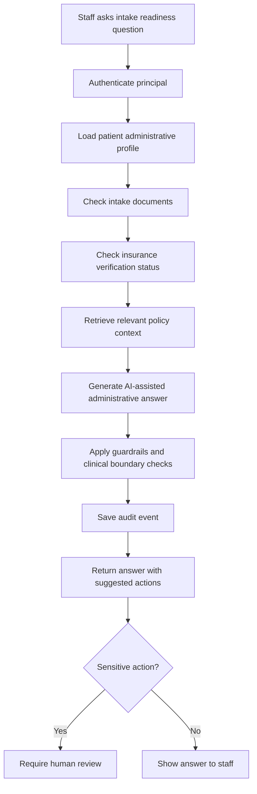
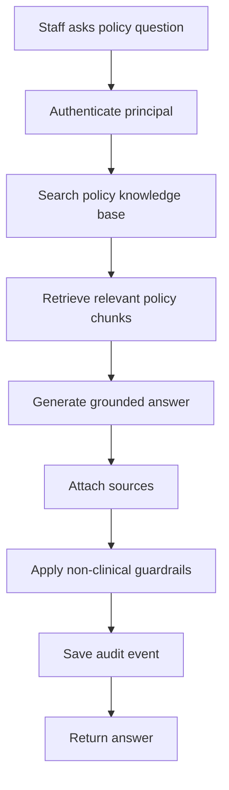
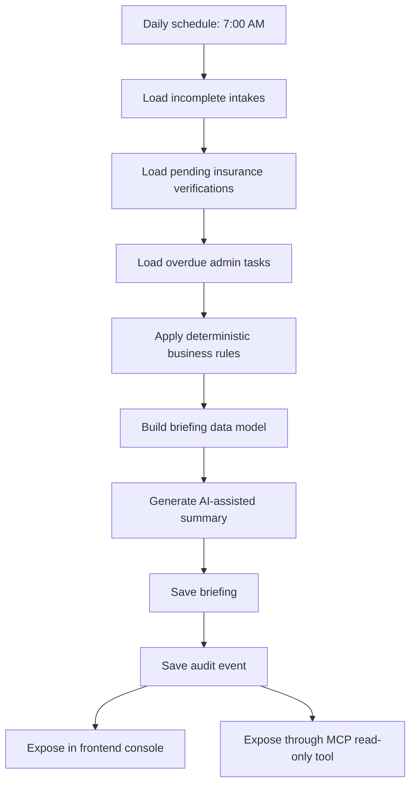
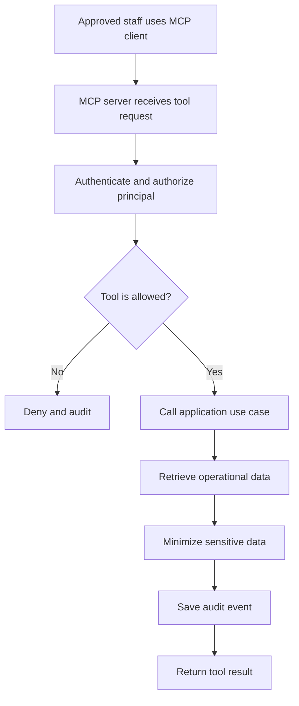
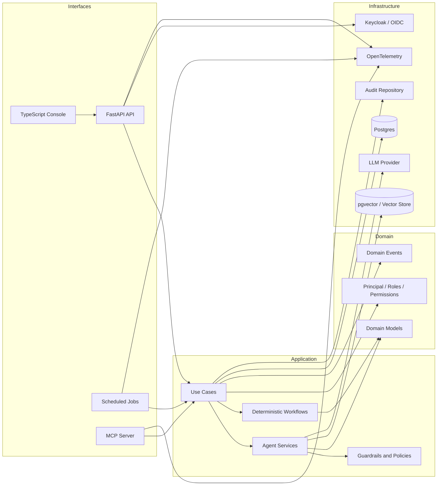

# Custodia

**A guarded AI operations layer for mental health administration.**

Custodia is a Python-based agent runtime for administrative automation in behavioral health organizations. It combines deterministic workflows, AI-assisted agents, RAG over internal policies, audit-first execution, observability, and secure operational interfaces such as APIs, scheduled jobs, and MCP tools.

Custodia is not intended to replace clinicians, make diagnoses, recommend treatment, or automate clinical judgment. Its initial scope is administrative and operational support for mental health practices.

---

## Objective

The goal of Custodia is to explore and implement a production-oriented AI agent platform for mental health administration.

The project is designed as a reference implementation for:

- administrative AI agents,
- deterministic operational workflows,
- RAG over internal policies and procedures,
- auditability and observability,
- PHI-aware system boundaries,
- MCP-based internal tooling,
- durable jobs and workflow execution,
- a TypeScript operations console.

The system is intentionally designed as a learning and architecture project, but with production-grade concerns from the beginning.

---

## Business Context

Modern mental health practices often need to manage a large amount of administrative work around patient care:

- intake forms,
- consent documents,
- insurance verification,
- scheduling readiness,
- internal policies,
- administrative follow-ups,
- daily operational summaries,
- task coordination across staff.

These workflows are often repetitive, time-sensitive, and fragmented across systems. Custodia explores how AI agents can assist with this work while keeping clinical decisions and sensitive actions under clear human and security controls.

---

## What Custodia Is

Custodia is:

- an AI operations layer for administrative workflows,
- a Python backend with clean architectural boundaries,
- a platform for deterministic workflows enriched by LLMs where useful,
- an audit-first system for sensitive operational environments,
- a foundation for MCP tools and internal AI assistants,
- a system designed around explicit human review for sensitive actions.

---

## What Custodia Is Not

Custodia is not:

- a clinical diagnosis system,
- a therapy chatbot,
- a treatment recommendation engine,
- a replacement for clinicians,
- an autonomous system for sensitive clinical decisions,
- a place to dump unrestricted PHI into prompts or logs.

The initial design principle is:

> Deterministic workflows should make operational decisions. AI should summarize, explain, retrieve context, draft, classify, and assist where it adds value.

---

## Core Use Cases

### Use Case 1: Intake Readiness Assistant

Administrative staff can ask what is missing before a patient can be scheduled for a first appointment.

Example question:

```text
What is missing before patient PAT-123 can be scheduled?
```

The system can:

- load the patient administrative profile,
- inspect intake documents,
- check consent status,
- check insurance verification status,
- retrieve relevant internal policy context,
- generate an administrative answer,
- suggest next actions,
- mark whether human review is required,
- write an audit event.



---

### Use Case 2: Internal Policy Assistant

Staff can ask operational questions about clinic policies.

Example questions:

```text
What is the no-show policy?
When can a patient be scheduled if consent forms are missing?
What is the process for pending insurance verification?
```

The system can:

- retrieve policy chunks from internal documents,
- generate an answer with source references,
- avoid making clinical recommendations,
- audit the query.



---

### Use Case 3: Daily Administrative Briefing

A scheduled job generates a daily operational summary for administrative teams.

This workflow is mostly deterministic. AI is used only to produce a clear human-readable summary and optional next-action suggestions.

The workflow can:

- find incomplete intakes,
- find pending insurance verifications,
- find overdue administrative tasks,
- apply business rules,
- retrieve relevant policy context if needed,
- generate a daily briefing,
- store the briefing,
- expose it through the frontend and MCP tools.



---

### Use Case 4: MCP Read-Only Operational Tools

Approved staff can query operational data through an MCP-compatible interface.

Initial tools should be read-only:

- `list_pending_intakes`,
- `get_patient_admin_summary`,
- `search_internal_policy`,
- `get_daily_admin_briefing`.

Write-capable tools should come later and require strict authorization, auditability, idempotency, and human approval where appropriate.



---

## High-Level Architecture

Custodia follows a **hexagonal-inspired, Go-like Python architecture**.

The goal is not to reproduce Java/Spring patterns in Python. Instead, the architecture uses small protocols, explicit runtime composition, and clear adapter boundaries.



---

## Architectural Style

Custodia uses:

- Python protocols for small ports,
- explicit dependency wiring in `runtime.py`,
- FastAPI only at the system boundary,
- Postgres-backed persistence,
- audit events separate from logs,
- OpenTelemetry for observability,
- Keycloak/OIDC for identity,
- deterministic workflows where possible,
- AI-assisted steps only where they add operational value.

The core architectural rule is:

> Interfaces call application use cases. Use cases depend on small protocols. Infrastructure implements those protocols. The runtime composes everything explicitly.

---

## Initial Repository Structure

```text
custodia-agent-runtime/
  backend/
    src/
      custodia/
        app/
          main.py
          runtime.py
          settings.py

        domain/
          identity.py
          patients.py
          intake.py
          tasks.py
          audit.py
          agents.py

        application/
          ports.py
          intake_agent.py
          policy_agent.py
          daily_briefing.py
          guardrails.py

        infrastructure/
          identity/
            keycloak_validator.py
            fake_auth.py

          persistence/
            postgres.py
            patient_repository.py
            audit_repository.py
            task_repository.py

          rag/
            text_chunker.py
            keyword_retriever.py
            vector_retriever.py

          llm/
            fake_llm.py
            openai_llm.py

          observability/
            tracing.py
            logging.py

        interfaces/
          api/
            routes.py
            middleware.py

          jobs/
            daily_admin_briefing_job.py

          mcp/
            server.py

    tests/
      unit/
      integration/
      evals/

  frontend/
    src/
      app/
      components/
      pages/
      api/

  docker/
    keycloak/
    postgres/
    otel/

  docs/
    architecture/
    decisions/
```

---

## Technical Stack

### Backend

- Python
- FastAPI
- Pydantic
- pytest
- ruff
- mypy
- Postgres
- pgvector, planned
- OpenTelemetry
- Keycloak / OIDC
- MCP server, planned

### Frontend

- TypeScript
- React or Next.js
- Admin operations console

### Infrastructure

- Docker Compose for local development
- Postgres
- Keycloak
- OpenTelemetry Collector
- Jaeger, initially
- Optional Grafana/Prometheus later

---

## Security, PHI, Auditability, and Guardrails

Custodia is designed for PHI-sensitive administrative workflows.

Initial principles:

- authenticate users through SSO/OIDC,
- model principals, roles, scopes, and permissions,
- minimize PHI exposure,
- avoid PHI in logs,
- avoid full prompt logging by default,
- audit business-relevant events,
- separate observability from auditability,
- require human review for sensitive actions,
- keep clinical judgment outside agent automation,
- design tool execution around least privilege.

### Observability vs Auditability

Observability answers:

```text
What happened technically?
Where did latency occur?
Which tool failed?
How long did the agent run take?
```

Auditability answers:

```text
Who accessed what?
Which patient administrative profile was viewed?
Which agent or tool was invoked?
Was a sensitive action suggested or executed?
Was human review required?
```

Both are required, but they are not the same thing.

---

## Audit Events

Initial audit events may include:

- `INTAKE_PROFILE_VIEWED`
- `INTAKE_AGENT_ANSWERED`
- `POLICY_CONTEXT_RETRIEVED`
- `DAILY_BRIEFING_GENERATED`
- `MCP_TOOL_INVOKED`
- `ADMIN_TASK_CREATED`
- `HUMAN_REVIEW_REQUIRED`
- `TOOL_CALL_DENIED`
- `TOOL_CALL_COMPLETED`

Audit records should include:

- actor subject,
- actor email,
- actor roles,
- action,
- resource type,
- resource id,
- agent name,
- tool name,
- outcome,
- human review flag,
- trace id,
- metadata.

---

## Observability

Custodia should trace:

- HTTP requests,
- scheduled jobs,
- MCP tool calls,
- agent runs,
- RAG retrieval,
- LLM calls,
- tool calls,
- workflow steps.

Initial observability stack:

```text
OpenTelemetry -> Collector -> Jaeger
```

Future production observability may include:

- metrics dashboards,
- alerting,
- latency budgets,
- agent success/failure rates,
- guardrail violation counts,
- human review rates,
- evaluation drift.

---

## Evaluation

Custodia should include an evaluation harness for agent behavior.

Evaluation areas:

- grounded answers,
- policy source usage,
- non-clinical boundaries,
- refusal behavior for clinical advice,
- PHI minimization,
- suggested action correctness,
- human review detection,
- RAG retrieval quality.

Example evaluation case:

```json
{
  "name": "missing_consent_forms_requires_human_review",
  "input": {
    "patient_id": "PAT-123",
    "question": "Can this patient be scheduled?"
  },
  "expected": {
    "mentions_missing_consent": true,
    "requires_human_review": true,
    "does_not_give_clinical_advice": true
  }
}
```

---

## Roadmap

### Phase -1: Project Name and GitHub Repository

- Choose project name.
- Create GitHub repository.
- Add README.
- Add AGENTS.md.
- Define initial architecture and project scope.

### Phase 0: Project Skeleton

- Create backend Python project.
- Create frontend TypeScript project.
- Add Docker Compose.
- Add Postgres.
- Add Keycloak local configuration.
- Add basic FastAPI app.
- Add runtime composition.
- Add pytest, ruff, and mypy.
- Add initial CI-friendly commands.

### Phase 1: Intake Agent

- Define patient administrative profile model.
- Define intake document model.
- Define small Python protocols.
- Implement in-memory patient repository.
- Implement fake LLM.
- Implement `IntakeAgentService`.
- Add API endpoint.
- Add unit tests.

### Phase 2: RAG Over Internal Policies

- Add internal policy documents.
- Add text chunker.
- Add keyword retriever.
- Add policy assistant use case.
- Include policy context in intake answers.
- Add source references.
- Add initial RAG tests.

### Phase 3: Audit and Observability

- Add Postgres audit table.
- Add audit repository.
- Add audit events for agent runs and policy retrieval.
- Add request id middleware.
- Add OpenTelemetry tracing.
- Add Jaeger local setup.
- Ensure logs do not include PHI.

### Phase 4: Deterministic Jobs and Durable Workflows

- Add daily administrative briefing job.
- Define deterministic briefing data model.
- Add retryable workflow step abstraction.
- Persist job execution status.
- Audit job execution.
- Expose briefing through API.

### Phase 5: MCP Tools

- Add MCP server interface.
- Add read-only tools:
  - `list_pending_intakes`
  - `get_patient_admin_summary`
  - `search_internal_policy`
  - `get_daily_admin_briefing`
- Add tool-level authorization.
- Add MCP audit events.

### Phase 6: Real LLM and Vector Store

- Add real LLM adapter.
- Add embeddings adapter.
- Add pgvector or vector database support.
- Replace keyword retriever with vector retriever.
- Add structured output validation.
- Add prompt and response safety checks.

### Phase 7: TypeScript Frontend Console

- Add operations dashboard.
- Show daily briefing.
- Show pending intakes.
- Show patient administrative summary.
- Show agent runs.
- Show audit log view.
- Add Keycloak login flow.

### Phase 8: Evaluation Harness and Production Hardening

- Add evaluation dataset.
- Add automated evaluation runner.
- Add regression checks for agent behavior.
- Add guardrail tests.
- Add deployment notes.
- Add production-readiness checklist.

---

## Local Development Plan

Initial local services:

```text
Postgres
Keycloak
OpenTelemetry Collector
Jaeger
Backend API
Frontend Console
```

Planned commands:

```bash
docker compose up -d
cd backend
uv sync
uv run pytest
uv run ruff check .
uv run mypy .
uv run fastapi dev src/custodia/app/main.py
```

Frontend commands:

```bash
cd frontend
npm install
npm run dev
```

---

## Production Considerations

Future production work should address:

- real identity provider integration,
- BAA-compatible AI provider setup,
- PHI-safe prompt management,
- secure secrets management,
- tenant isolation if needed,
- real EHR or practice management integrations,
- real communication platform integrations,
- durable workflow engine selection,
- audit retention policies,
- admin escalation workflows,
- human approval queues,
- evaluation dashboards,
- incident response procedures.

---

## Guiding Principle

Custodia is not a chatbot.

Custodia is a guarded operational layer where deterministic workflows, AI-assisted agents, RAG, auditability, observability, MCP tools, and human review work together to reduce administrative burden in mental health operations.
